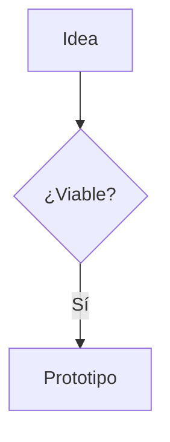

# slidedown

Framework de presentaciones basado en **Markdown**, sin build, pensado para cocrear con IA.

Clona este repo para cada presentación nueva: edita `slides.md` y `theme/themes/*.css`, abre `index.html` y listo.

## Uso rápido

```bash
# sirve la presentación (fetch necesita HTTP)
python3 -m http.server

# abre http://localhost:8000
```

> **Recarga:** para ver cambios en `slides.md` y el CSS basta con recargar (F5).
> Si editas `lib/slidedown.js`, usa recarga forzada (`shift` + recargar) para
> descartar la caché del navegador.

O escribe el markdown inline en `index.html` y ábrelo con doble clic (sin servidor):

```html
<sd-deck>
  <script type="text/slidedown">
    # Mi título
    ---
    ## Segunda diapositiva
  </script>
</sd-deck>
```

## Estructura

```
slidedown/
├── index.html            # Punto de entrada
├── slides.md             # Contenido de la presentación
├── theme/
│   ├── tokens.css        # Design tokens (el "estilo" del tema)
│   ├── base.css          # Estructura (no tocar para crear temas)
│   ├── layouts.css       # Layouts y posicionamiento
│   ├── transitions.css   # Transiciones y animaciones
│   ├── diagrams.css      # Mermaid + flechas SVG
│   ├── print.css         # Export PDF
│   └── themes/           # Temas: light, dark, blueprint (plantilla)
├── lib/
│   ├── marked.min.js     # Parser markdown (vendored)
│   ├── mermaid.min.js    # Diagramas (vendored, carga perezosa)
│   └── slidedown.js      # El framework
└── samples/              # Decks de ejemplo (funcionan como documentación)
```

## Sintaxis

### Diapositivas y directivas

```markdown
---
title: Mi presentación
theme: dark
transition: slide
---

<!-- slide: layout=title -->
# Título

---

<!-- slide: layout=two-cols transition=zoom bg=img/fondo.png -->
```

Directivas de slide: `layout`, `transition`, `bg`, y `theme` en el frontmatter del deck.

### Layouts

`default`, `center`, `title`, `section`, `quote`, `full`, `free`.

Columnas con fenced divs (el JS las cuenta):

```markdown
::: col
## Izquierda
:::
::: col
## Derecha
:::
```

### Posicionamiento libre (infografías)

```markdown
<!-- slide: layout=free -->

::: textbox id=caja1 pos-10-20 w-40
### Caja flotante
contenido...
:::

::: arrow from=caja1 to=caja2 curve=.25 :::
```

- `pos-X-Y` → `left:X% top:Y%`
- `w-N` / `h-N` → ancho / alto en porcentaje
- `id=nombre` → referencia para las flechas
- Flechas: `::: arrow from=A to=B curve=.3 :::` (curva entre 0 y 1)

### Imágenes

Las imágenes se escriben en markdown; las rutas son **relativas a la carpeta
del deck** (cada deck con sus imágenes). Se dimensionan con clases al estilo
del framework:

```markdown
{.img-w-40 .img-shadow}
```

Clases disponibles:

| Clase | Efecto |
|---|---|
| (por defecto) | `max-width:100%`, esquinas redondeadas |
| `.img-w-25` / `.img-w-40` / `.img-w-50` / `.img-w-60` / `.img-w-80` | ancho en % |
| `.img-center` | centrada (margen auto) |
| `.img-shadow` | sombra (`--sd-shadow-md`) |
| `.img-full` | cubre toda la diapositiva |

También puedes usar HTML crudo: ``.
Para poner imagen y texto lado a lado, usa columnas:

```markdown
::: col
{.img-w-80}
:::
::: col
## Texto al lado
Contenido...
:::
```

### Fragmentos (revelado progresivo)

```markdown
- Este punto aparece primero {fragment}
- Este segundo {fragment}

::: fragment
Este bloque completo se revela de una vez.
:::
```

Pulsa `→` para revelar fragmentos; `←` para retroceder.

### Diagramas Mermaid

````markdown

````

`lib/mermaid.min.js` se carga solo si hay bloques `mermaid`.

### Notas del orador

```markdown
<!-- notes: Texto para mí. Se ve con N y al exportar a PDF. -->
```

## Controles

| Tecla | Acción |
|---|---|
| `→` / `Espacio` / `↓` / `PgDn` / `Enter` | Siguiente (revela fragmentos) |
| `←` / `↑` / `PgUp` / `Backspace` | Anterior |
| `Inicio` / `Fin` | Primera / última |
| `F` | Pantalla completa |
| `O` | Resumen de miniaturas |
| `T` | Cambiar tema (light/dark/blueprint) |
| `N` | Panel de notas |
| `P` | Exportar PDF |

## Crear un tema nuevo

Los temas **solo sobreescriben tokens** (`--sd-*` definidos en `theme/tokens.css`, comentados y agrupados). La estructura (`base.css`, layouts, transiciones, diagramas) no se toca.

1. Copia `theme/themes/blueprint.css` → `theme/themes/mi-tema.css`.
2. Cambia el selector a `[data-theme="mi-tema"]`.
3. Sobreescribe los tokens que quieras (receta mínima de 10 en el sample `99-theme`).
4. Enlaza el archivo en `index.html` y usa `theme: mi-tema` en el frontmatter.

## Samples (documentación funcional)

| Sample | Muestra |
|---|---|
| `samples/00-layouts` | Todos los layouts, columnas y componentes |
| `samples/01-transitions` | Transiciones y fragments |
| `samples/02-diagrams` | Mermaid + infografía con flechas SVG |
| `samples/03-textboxes` | Colocación libre de cajas |
| `samples/04-notes` | Notas del orador |
| `samples/99-theme` | Cómo crear un tema (con receta) |

Para la IA: los samples son el manual de uso. Léelos junto a `theme/tokens.css`.

## Desarrollo y verificación

La suite de verificación (Playwright) recorre el deck raíz y todos los samples,
navega por cada diapositiva y comprueba estructura, geometría, diagramas y
ausencia de errores de consola. Genera capturas en `test/screenshots/`.

Entorno reproducible con conda (nodejs incluido):

```bash
conda env create -f environment.yml
conda activate slidedown
npm install
npx playwright install chromium
npm test          # ejecuta la suite (test/verify.mjs)
```

- `npm test` sale con código 0 si todo pasa, o distinto de 0 si algo falla.
- Para añadir aserciones nuevas: edita `test/verify.mjs`.
- `node_modules/`, `package-lock.json`, `test/screenshots/`, `playwright-report/`
  y `test-results/` están en `.gitignore`.
