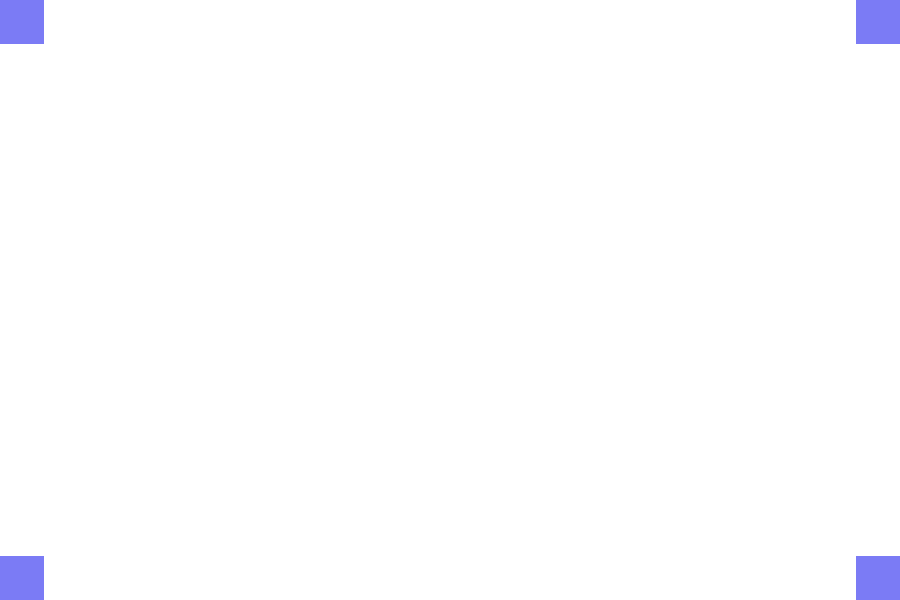
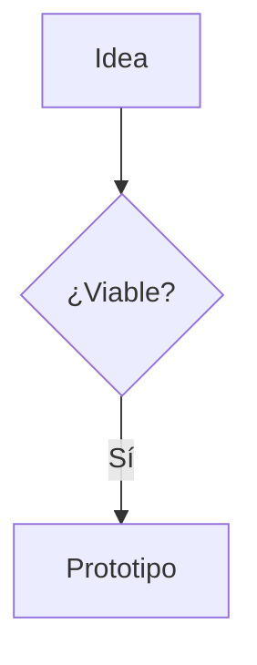

# slidedown

Framework de presentaciones basado en **Markdown**, sin build, pensado para cocrear con IA.

Clona este repo para cada presentación nueva: edita `slides.md` y `theme/themes/*.css`, abre `index.html` y listo.

## Uso rápido

```bash
cd framework
conda activate slidedown
npm run serve        # sirve la web con autoreload

# abre http://localhost:8000  (otro puerto: npm run serve -- --port 9000)
```

**Autoreload:** al guardar `slides.md`, `custom.css`, el tema o `index.html` el
navegador se actualiza solo. El markdown se re-renderiza **en caliente
conservando la diapositiva actual** (los fragmentos revelados se reinician);
los cambios de CSS/HTML/JS recargan la página completa. El servidor de desarrollo
desactiva la caché del navegador: no hacen falta F5 ni recargas forzadas.

O escribe el markdown inline en `index.html` y ábrelo con doble clic (sin servidor):

```html
<sd-deck>
  <script type="text/slidedown">
    # Mi título
    ---
    ## Segunda diapositiva
  </script>
</sd-deck>
```

## Estructura

```
slidedown/                 # raíz = UNA presentación (lo que editas)
├── index.html             # Punto de entrada
├── slides.md              # Contenido de la presentación
├── custom.css             # Overrides de aspecto de ESTA presentación
├── img/                   # Imágenes de esta presentación
└── framework/             # Reutilizable: NO se toca al presentar
    ├── lib/
    │   ├── marked.min.js  # Parser markdown (vendored)
    │   ├── mermaid.min.js # Diagramas (vendored, carga perezosa)
    │   └── slidedown.js   # El framework
    ├── theme/
    │   ├── tokens.css     # Design tokens (el "estilo" del tema)
    │   ├── base.css       # Estructura (no tocar para crear temas)
    │   ├── layouts.css    # Layouts y posicionamiento
    │   ├── transitions.css# Transiciones y animaciones
    │   ├── diagrams.css   # Mermaid + flechas SVG
    │   ├── print.css      # Export PDF
    │   └── themes/        # Temas: light, dark, blueprint (plantilla)
    ├── samples/           # Decks de ejemplo (documentación funcional)
    ├── test/              # Suite de verificación, servidor dev (serve.mjs) y generador de assets
    ├── package.json       # npm test / gen-assets
    └── environment.yml    # Entorno conda reproducible
```

Al clonar para una presentación nueva, el `framework/` viene incluido: solo
editas la raíz (`slides.md`, `custom.css`, `img/`).

## Sintaxis

### Diapositivas y directivas

```markdown
---
title: Mi presentación
theme: dark
transition: slide
---

<!-- slide: layout=title -->
# Título

---

<!-- slide: layout=two-cols transition=zoom bg=img/fondo.png -->
```

Directivas de slide: `layout`, `transition`, `bg`, y `theme` en el frontmatter del deck.

**Imagen de fondo** con `bg=` (ruta relativa a la carpeta del deck). La imagen
cubre toda la diapositiva (`background-size: cover`). Para que el texto sea
legible se añade una capa de oscurecimiento configurable:

```markdown
<!-- slide: layout=title bg=img/portada.png&dark=0.5 -->
# Portada
```

- `dark=0` → sin oscurecer · `dark=1` → casi negro.
- Si no se indica, usa el token del tema `--sd-bg-overlay` (por defecto `.35`).
- Sin `dark` ni token: `.35`.

### Layouts

`default`, `center`, `title`, `section`, `quote`, `full`, `free`.

Columnas con fenced divs (el JS las cuenta):

```markdown
::: col
## Izquierda
:::
::: col
## Derecha
:::
```

### Posicionamiento libre (infografías)

```markdown
<!-- slide: layout=free -->

::: textbox id=caja1 pos-10-20 w-40
### Caja flotante
contenido...
:::

::: arrow from=caja1 to=caja2 curve=.25 :::
```

- `pos-X-Y` → `left:X% top:Y%`
- `w-N` / `h-N` → ancho / alto en porcentaje
- `id=nombre` → referencia para las flechas
- Flechas: `::: arrow from=A to=B curve=.3 :::` (curva entre 0 y 1)

Las flechas salen del **borde** de la caja de origen y llegan al **borde** de la
caja de destino. El borde se elige automáticamente según la dirección entre las
cajas, salvo que lo fuerces con:

- `side=top|right|bottom|left` → fuerza el borde de salida en la caja de origen.
- `to-side=top|right|bottom|left` → fuerza el borde de llegada en la de destino.

```markdown
::: arrow from=A to=B curve=.25 :::
::: arrow from=A to=B side=bottom to-side=top curve=.3 :::
```

Las cajas (`::: textbox :::` / `::: box :::`) pueden contener **imágenes**:
se escriben en markdown dentro de la caja y se ajustan con las clases de imagen
(`.img-w-*`, `.img-center`). La altura de la caja crece con el contenido.

```markdown
::: textbox id=srv pos-5-15 w-30
{.img-w-40 .img-center}
### Servidor
Descripción...
:::

::: arrow from=srv to=cli curve=.3 :::
```

### Imágenes

Las imágenes se escriben en markdown; las rutas son **relativas a la carpeta
del deck** (cada deck con sus imágenes). Se dimensionan con clases al estilo
del framework:

```markdown
{.img-w-40 .img-shadow}
```

Clases disponibles:

| Clase | Efecto |
|---|---|
| (por defecto) | `max-width:100%`, esquinas redondeadas |
| `.img-w-25` / `.img-w-40` / `.img-w-50` / `.img-w-60` / `.img-w-80` | ancho en % |
| `.img-center` | centrada (margen auto) |
| `.img-shadow` | sombra (`--sd-shadow-md`) |
| `.img-full` | cubre toda la diapositiva |

También puedes usar HTML crudo: ``.
Para poner imagen y texto lado a lado, usa columnas:

```markdown
::: col
{.img-w-80}
:::
::: col
## Texto al lado
Contenido...
:::
```

### Fragmentos (revelado progresivo)

```markdown
- Este punto aparece primero {fragment}
- Este segundo {fragment}

::: fragment
Este bloque completo se revela de una vez.
:::
```

Pulsa `→` para revelar fragmentos; `←` para retroceder.

### Diagramas Mermaid

````markdown

````

`lib/mermaid.min.js` se carga solo si hay bloques `mermaid`.

### Notas del orador

```markdown
<!-- notes: Texto para mí. Se ve con N y al exportar a PDF. -->
```

## Controles

| Tecla | Acción |
|---|---|
| `→` / `Espacio` / `↓` / `PgDn` / `Enter` | Siguiente (revela fragmentos) |
| `←` / `↑` / `PgUp` / `Backspace` | Anterior |
| `Inicio` / `Fin` | Primera / última |
| `F` | Pantalla completa |
| `O` | Resumen de miniaturas |
| `T` | Cambiar tema (light/dark/blueprint) |
| `N` | Panel de notas |
| `P` | Exportar PDF (impresión rápida del navegador) |

## Crear un tema nuevo

Los temas **solo sobreescriben tokens** (`--sd-*` definidos en `theme/tokens.css`, comentados y agrupados). La estructura (`base.css`, layouts, transiciones, diagramas) no se toca.

1. Copia `theme/themes/blueprint.css` → `theme/themes/mi-tema.css`.
2. Cambia el selector a `[data-theme="mi-tema"]`.
3. Sobreescribe los tokens que quieras (receta mínima de 10 en el sample `99-theme`).
4. Enlaza el archivo en `index.html` y usa `theme: mi-tema` en el frontmatter.

## Personalizar el aspecto de una presentación (sin tocar el core)

Para **una presentación concreta** no hace falta crear/editar un tema: usa
`custom.css` (en la raíz), que se carga al final y gana por cascada sobre
`theme/*.css`.

**Escoger un tema compartido** (en el frontmatter del deck):

```markdown
---
theme: dark
---
```

**Sobreescribir tokens** (fuente, color, radio...) en `custom.css`:

```css
[data-theme="dark"] {
  --sd-font-heading: 'Georgia', serif;
  --sd-accent: #c0532e;
}
```

**Apuntar a una slide concreta** con su `id` (en la directiva de slide):

```markdown
<!-- slide: layout=title id=portada -->
# Mi título
```

```css
#portada h1 { color: var(--sd-accent); }
#portada { background: #111; }
```

El `id` de una slide es opcional: ponlo solo si quieres hacerle una regla CSS.

## Samples (documentación funcional)

| Sample | Muestra |
|---|---|
| `samples/00-layouts` | Todos los layouts, columnas y componentes |
| `samples/01-transitions` | Transiciones y fragments |
| `samples/02-diagrams` | Mermaid + infografía con flechas SVG |
| `samples/03-textboxes` | Colocación libre de cajas |
| `samples/04-notes` | Notas del orador |
| `samples/05-overflow` | Contenido denso que desborda: el auto-fit escala para que **todo cabe** sin scroll ni truncado |
| `samples/99-theme` | Cómo crear un tema (con receta) |

Para la IA: los samples son el manual de uso. Léelos junto a `theme/tokens.css`.

## Exportar a PDF pixel-perfect (con texto)

El botón `P` / `Ctrl+P` es una impresión rápida del navegador. Para un PDF
que **replique lo que se ve en pantalla** (1280×720 pt por diapositiva,
fragmentos revelados, texto vectorial seleccionable) usa el exportador del
framework — mismo CSS de impresión (`theme/print.css`) pero renderizado de
forma determinística con Playwright:

```bash
cd framework
conda activate slidedown
npm install                 # instala playwright + pdf-lib
npx playwright install chromium
npm run pdf                 # → slides.pdf en la raíz (presentación)
npm run pdf -- samples/02-diagrams --out /tmp/diagramas.pdf
npm run pdf:raster          # modo raster (screenshots PNG, píxel literal)
```

* Vector (por defecto): `page.pdf` con `printBackground:true` y `@page 1280×720` — texto y SVG como vectores.
* Raster (`--raster`): screenshots de cada `.sd-slide` a `1280×720` montados con `pdf-lib` — píxel literal, sin texto seleccionable.
* Requiere el mismo entorno que `npm test` (`framework/environment.yml` → `nodejs=22` vía conda).

## Desarrollo y verificación

La suite de verificación (Playwright) recorre la presentación raíz y todos los
samples, navega por cada diapositiva y comprueba estructura, geometría,
diagramas y ausencia de errores de consola. Genera capturas en
`framework/test/screenshots/` y verifica el export PDF vector en
`framework/test/pdf/`.

Todo el tooling de desarrollo vive en `framework/`:

```bash
cd framework
conda env create -f environment.yml
conda activate slidedown
npm install
npx playwright install chromium
npm run serve      # servidor dev con autoreload (sirve la presentación raíz)
npm test           # ejecuta la suite (test/verify.mjs) — incluye check del PDF
npm run pdf        # exporta la presentación raíz a slides.pdf (vector)
npm run gen-assets  # regenera los placeholders (assets versionados en git)
```

- `npm test` sale con código 0 si todo pasa, o distinto de 0 si algo falla.
- Para añadir aserciones nuevas: edita `test/verify.mjs`.
- `node_modules/`, `package-lock.json`, `test/screenshots/`, `playwright-report/`
  y `test-results/` están en `.gitignore`.
