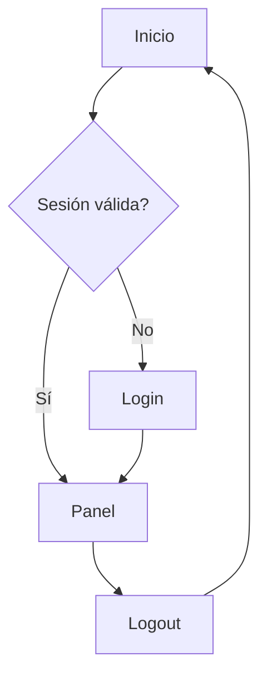
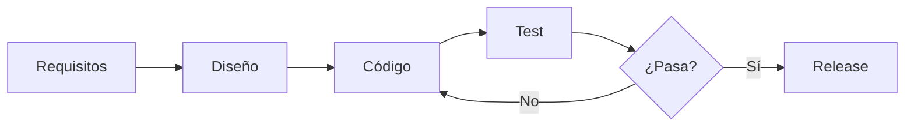
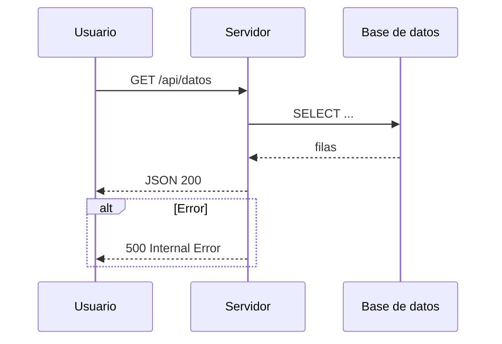
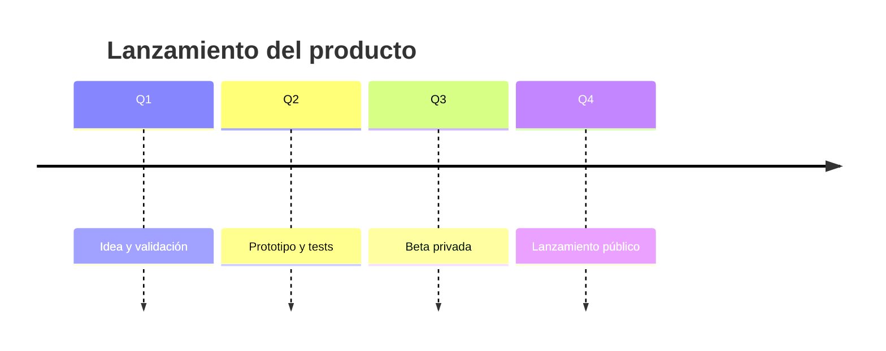
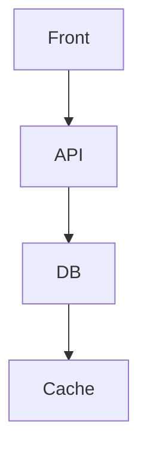
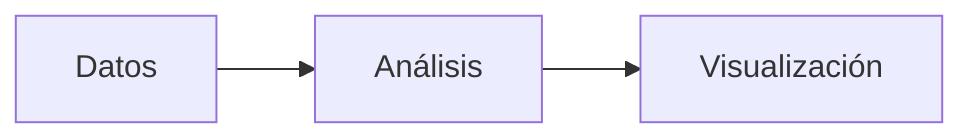
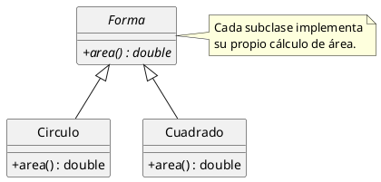
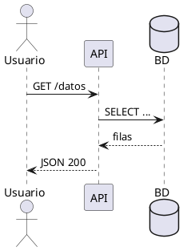

<!-- ============================================================
   SAMPLE 02 — DIAGRAMAS
   Tres formas:
   1) Mermaid:  ```mermaid ... ```  (diagramas de texto)
   2) PlantUML: ```plantuml ... ``` (UML: clases, secuencia, ...)
   3) Infografía: cajas posicionadas + flechas SVG con ::: arrow :::.
   ============================================================ -->

# Diagramas con Mermaid

Escribe el diagrama en texto; el navegador lo dibuja.



---

## Flowchart horizontal



---

## Diagrama de secuencia



---

## Timeline



---

# Infografía con flechas SVG

Cajas posicionadas conectadas por `::: arrow :::`.

<!-- slide: layout=free transition=zoom -->
::: textbox id=entrada pos-5-8 w-26
### Entrada
Datos crudos de varias fuentes.
:::

::: box id=limpieza pos-38-8 w-26
### Limpieza
Filtrado, deduplicado, normalizado.
:::

::: box id=analisis pos-71-8 w-26
### Análisis
Agregación y métricas clave.
:::

::: textbox id=modelo pos-38-55 w-26
### Modelo
Entrenamiento y validación.
:::

::: box id=salida pos-71-55 w-26
### Salida
Informes y alertas.
:::

::: arrow from=entrada to=limpieza curve=.2 :::
::: arrow from=limpieza to=analisis curve=.2 :::
::: arrow from=limpieza to=modelo curve=.35 :::
::: arrow from=modelo to=salida curve=.2 :::
::: arrow from=analisis to=salida curve=.35 :::

---

# Combinando Mermaid y flechas

Mermaid dentro de una columna, flechas en la otra.

::: col

:::

::: col
::: textbox id=fa pos-10-10 w-70
**Front**
Lo que ve el usuario.
:::

::: textbox id=ba pos-10-58 w-70
**Backend**
Lógica y persistencia.
:::

::: arrow from=fa to=ba curve=.25 :::
:::

---

# Imagen y diagrama

::: col
{.img-w-80 .img-shadow}
:::

::: col
## Diagrama + imagen

Puedes mezclar imágenes y diagramas en las columnas:


:::

---

# Flechas con `side`

Puedes forzar el borde de salida/llegada con `side` y `to-side`:

<!-- slide: layout=free transition=zoom -->
::: textbox id=a pos-10-40 w-30
### Origen
Sale por el borde **inferior**.
:::

::: textbox id=b pos-60-10 w-30
### Destino
Llega por el borde **superior**.
:::

::: arrow from=a to=b side=bottom to-side=top curve=.35 :::

---

# Cajas con imágenes

Las cajas de la infografía pueden contener imágenes, con flechas entre ellas:

<!-- slide: layout=free transition=zoom -->
::: textbox id=srv pos-3-8 w-26
{.img-w-40 .img-center}
### Servidor
Procesa las peticiones.
:::

::: box id=cli pos-71-8 w-26
{.img-w-40 .img-center}
### Cliente
Envia consultas.
:::

::: box id=qry pos-37-55 w-26
{.img-w-40 .img-center}
### Consulta
La operación de datos.
:::

::: arrow from=cli to=srv curve=.3 :::
::: arrow from=srv to=qry curve=.25 :::
::: arrow from=qry to=cli curve=.25 :::

---

# Diagramas con PlantUML

Alternativa a Mermaid, más orientada a UML (clases, secuencia, despliegue...).



---

# PlantUML: diagrama de secuencia

Varios diagramas PlantUML en un deck se renderizan en serie (el motor no es reentrante).




