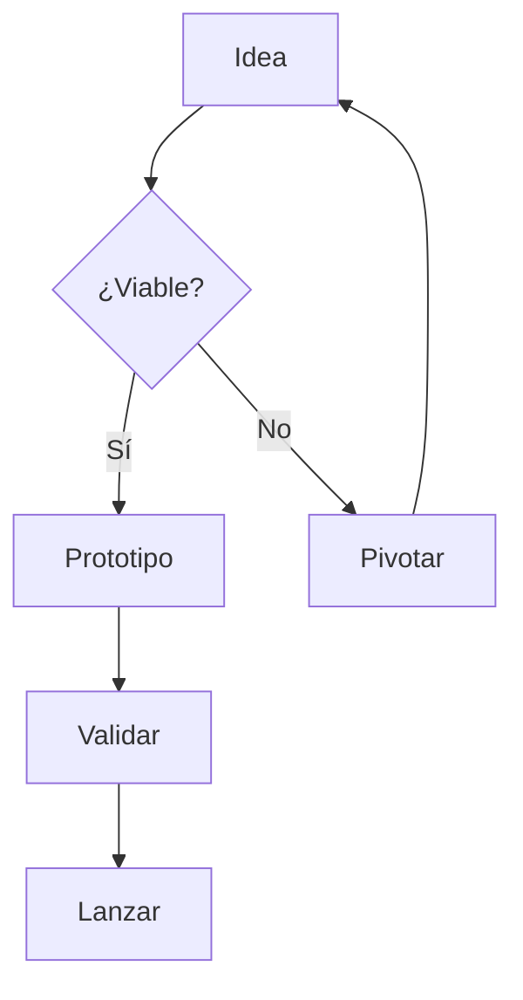

<!-- ============================================================
     Presentación de ejemplo.
     Para ver todos los recursos, abre los samples:
       samples/00-layouts    -> layouts y cajas
       samples/01-transitions-> transiciones y fragments
       samples/02-diagrams   -> Mermaid y flechas SVG
       samples/03-textboxes  -> infografía de colocación libre
       samples/04-notes      -> notas del orador
       samples/99-theme      -> cómo crear un tema
     ============================================================ -->

<!-- slide: layout=title -->
# slidedown
Presentaciones en **Markdown**, cero build.

<footer class="subtitle">Navega con ← → · Espacio · F pantalla completa · O resumen · T tema · P PDF</footer>

---

# ¿Qué puedes hacer? <span class="badge">Demo</span>

- Diapositivas separadas por `---`
- Layouts y columnas con `::: col :::`
- Imágenes en markdown con clases de tamaño
- Revelado progresivo con `{fragment}`
- Diagramas de texto con ` ```mermaid `
- Infografías con cajas posicionadas y flechas SVG
- Temas editables en **un solo archivo**

---

<!-- slide: layout=two-cols transition=zoom -->
::: col
## Izquierda

- Primer punto {fragment}
- Segundo punto {fragment}
- Tercer punto {fragment}

::: note info
Consejo: pulsa **→** varias veces para revelar los puntos.
:::
:::

::: col
## Derecha

1. Uno
2. Dos
3. Tres

| Token | Valor |
|---|---|
| `--sd-accent` | color de acento |
| `--sd-bg` | fondo |
:::

---

<!-- slide: layout=section transition=cover -->
# Mermaid
Diagramas de texto que dibuja el navegador.

---



---

<!-- slide: layout=free transition=fade -->
::: textbox id=idea pos-5-10 w-25
### Idea
El problema que queremos resolver.
:::

::: box id=proto pos-55-10 w-25
### Prototipo
Prueba rápida con feedback real.
:::

::: box id=valida pos-5-65 w-25
### Validación
¿De verdad resuelve el problema?
:::

::: box id=lanza pos-55-65 w-25
### Lanzamiento
Escala y mide resultados.
:::

::: arrow from=idea to=proto curve=.25 :::
::: arrow from=proto to=valida curve=.25 :::
::: arrow from=valida to=lanza curve=.25 :::

---

<!-- slide: layout=default transition=fade -->
::: col
{.img-w-80 .img-shadow}
:::

::: col
## Imágenes en columnas

Las imágenes se escriben en markdown y se dimensionan con clases:

- `{.img-w-40}` → ancho 40 %
- `{.img-center}` → centrada
- `{.img-shadow}` → sombra
- `{.img-round}` → esquinas redondeadas (por defecto)

Rutas relativas a la carpeta del deck.
:::

---

<!-- slide: layout=quote transition=flip -->
> "El mejor momento para plantar un árbol fue hace 20 años.
> El segundo mejor momento es ahora."
>
> <footer>— Proverbio</footer>

---

<!-- slide: layout=center -->
## Temas

Pulsa **T** para alternar entre `light`, `dark` y `blueprint`.

Un tema nuevo es un archivo que solo sobreescribe tokens:
ve `theme/themes/blueprint.css` como plantilla.

<!-- notes: Los temas se guardan en localStorage, así que la elección
persiste entre recargas. Para fijar el tema de la presentación usa
theme: light|dark|blueprint en el frontmatter del deck. -->

---

<!-- slide: layout=center transition=none -->
# Gracias

<span class="badge">Escrito en markdown</span>
